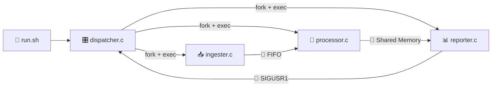

<div align="center">


**CS 2006: Operating Systems, Final Term Project**
📍 FAST NUCES, Islamabad Campus 🗓️ May 2026

[](https://www.gnu.org/software/gcc/)
[]()
[]()
[](https://github.com/AbdulAzeemHashmi/Operating-Systems-Project/stargazers)
[](https://github.com/AbdulAzeemHashmi/Operating-Systems-Project)

A fully parallel, **multi process, multi threaded** data pipeline on Linux that ingests web clickstream CSV files, aggregates per user session metrics across a thread pool, and writes formatted reports, all while demonstrating every major OS concept covered in the course. 🧵🔗📡

</div>

<div align="center">

</div>

---

## 👥 Team

<div align="center">

| 🧑‍💻 Name | 🆔 Roll Number | 🐙 GitHub |
|---|---|---|
| Abdul Rauf | 24I 0060 | [@abdul rauf789](https://github.com/abdul-rauf789) |
| Abdul Azeem | 24I 2013 | [@AbdulAzeemHashmi](https://github.com/AbdulAzeemHashmi) |

</div>

---

## 📋 Table of Contents

- [🔍 Overview](#-overview)
- [🏗️ Architecture](#️-architecture)
- [🧠 OS Concepts Demonstrated](#-os-concepts-demonstrated)
- [📁 Project Structure](#-project-structure)
- [📄 Input Format](#-input-format)
- [⚡ Quick Start](#-quick-start)
- [🚀 Usage](#-usage)
- [📊 Output](#-output)
- [🔄 IPC Resource Lifecycle](#-ipc-resource-lifecycle)
- [📡 Signal Handling](#-signal-handling)
- [🔢 Exit Codes](#-exit-codes)
- [👤 Work Division](#-work-division)

---

## 🔍 Overview

Modern web applications produce enormous volumes of clickstream data. Single threaded analysis cannot exploit the multiple CPU cores available on contemporary machines. This project solves that by building a **4 stage pipeline** across **4 separately compiled processes**, connected by three distinct IPC mechanisms. 🔧

<div align="center">

| 🎬 Stage | ⚙️ Executable | 🎯 Role |
|---|---|---|
| **Orchestrate** | `dispatcher` | Master process, forks children, manages IPC, reaps exits |
| **Ingest** | `ingester` | Scans input directory, streams CSV chunks through a named FIFO |
| **Process** | `processor` | Thread pool reads FIFO, parses rows, aggregates into shared memory |
| **Report** | `reporter` | Reads shared memory, writes `report.txt` and `report.csv` |

</div>

Two metrics are computed **per user** 📈:

- ⏱️ **Average Session Length**, total session time divided by visit count
- 🚪 **Bounce Rate (%)**, percentage of single interaction sessions

---

## 🏗️ Architecture

```
                         run.sh
                            |  launches
                            v
              +-----------------------------+
              |         dispatcher.c        |<--- SIGUSR1 (done)
              |  fork+exec | waitpid | IPC  |
              +-------------+---------------+
                 fork+exec  |
         +-------------------+-------------------+
         v                   v                    v
   +----------+     +-----------------------+     +--------------+
   |ingester.c|---->|processor.c            |---->|  reporter.c  |
   |reads CSV | FIFO|reader thd + N workers | SHM |  sem_wait    |
   |-> FIFO   |     |-> shm write           | sem |  dup/dup2    |
   +----------+     +-----------------------+     |  writes files|
                                                   +--------------+
```

<div align="center">



</div>

🔀 **Data flow:** `CSV files to FIFO to thread pool to shared memory to report files`

📶 **Signal flow:** `reporter to SIGUSR1 to dispatcher` (signals report completion)

---

## 🧠 OS Concepts Demonstrated

<div align="center">

| 🧩 Concept | 📍 Where | 🛠️ How |
|---|---|---|
| `fork()` + `exec()` | dispatcher | Three children created, each calls `execvp()` to replace its image |
| `wait()` / `waitpid()` | dispatcher | Reaps all three children, prevents zombie processes |
| 🧷 **Named FIFO** | ingester to processor | `mkfifo()` creates `/tmp/my_fifo`, binary `ChunkHeader` structs frame each CSV row |
| 💾 **POSIX Shared Memory** | processor to reporter | `shm_open()` plus `ftruncate()` plus `mmap()` creates `/my_shm`, holds aggregated `UserData[]` |
| 🚦 **Named Semaphore** | processor to reporter | `sem_open()` creates `/my_sem` (init equals 0), processor posts after writing, reporter blocks until ready |
| 🧵 `pthread_create()` / `join()` | processor | N worker threads plus 1 reader thread, explicit `pthread_attr_t` sets 1 MB stack, `JOINABLE` |
| 🔒 **Mutex** (`pthread_mutex_t`) | processor | `queue_mutex` protects circular buffer, `agg_mutex` makes aggregation table updates atomic |
| 🚥 **Unnamed Semaphores** | processor | `sem_empty` (init equals Q) plus `sem_full` (init equals 0), classic bounded buffer producer consumer |
| 📤 `dup()` / `dup2()` | dispatcher, reporter | Dispatcher redirects child stdout/stderr to log files before `execvp`, reporter saves, redirects, and restores stdout |
| 📡 **Signals** | all | `SIGINT`/`SIGTERM` trigger graceful shutdown, `SIGCHLD` triggers reap, `SIGUSR1` signals completion notification, `SIGUSR1` on ingester shows live stats |
| 🔢 **Exit Codes** | all | Standardized: `0` ok, `10` bad args, `20` IPC fail, `40` I/O error, `130` SIGINT, `143` SIGTERM |

</div>

---

## 📁 Project Structure

```
Operating-Systems-Project/
├── 🎛️ dispatcher.c       # Master process, IPC setup, fork+exec, cleanup
├── 📥 ingester.c         # CSV reader, FIFO writer
├── 🧵 processor.c        # Thread pool, FIFO reader, aggregator, SHM writer
├── 📊 reporter.c         # Report writer, SHM reader, dup/dup2 demo
├── 📦 common.h           # Shared structs: ChunkHeader, UserData, SharedData
├── ⚙️ Makefile            # Builds all four executables with -Wall -Wextra -pthread
├── 🧰 run.sh              # Bash orchestrator with getopts, trap, and summary
├── 📄 sample_file.csv     # Example input dataset (50 rows, 20 users)
├── 📃 report.txt          # Sample human readable output
├── 📈 report.csv          # Sample machine readable output
├── 📕 report.pdf          # Full project report
└── 📜 DECLARATION.txt     # Academic integrity declaration
```

---

## 📄 Input Format

CSV files go in your chosen input directory. Each row is one user session event:

```
user_id,value1[,value2,...,valueN]
```

```csv
user_id,session_length,pages_visited,bounced
user_001,342,12,0
user_002,8
user_003,567,23,0
user_001,201,7,0
```

- 🆔 **First column**, string user identifier
- 🔢 **Remaining columns**, integers (page durations and engagement metrics)
- ⚠️ A row with **only one numeric column** counts as a **bounce**
- 📚 Multiple CSV files in the input directory are all processed

---

## ⚡ Quick Start

### ✅ Prerequisites

```bash
# Ubuntu / Debian
sudo apt update && sudo apt install gcc make

# Verify
gcc --version
make --version
```

### 📥 Clone and Run

```bash
git clone https://github.com/AbdulAzeemHashmi/Operating-Systems-Project.git
cd Operating-Systems-Project

# Place your CSV files in a data/ folder, then:
chmod +x run.sh
./run.sh -i data/ -o output/ -n 4
```

---

## 🚀 Usage

### 🧰 Using the Bash orchestrator (recommended)

```bash
./run.sh -i <input_dir> -o <output_dir> -n <threads>
```

<div align="center">

| 🚩 Flag | 📝 Description | 🎯 Default |
|---|---|---|
| `-i` | Input directory containing `.csv` files | *(required)* |
| `-o` | Output directory for reports | `output/` |
| `-n` | Number of worker threads in processor | `4` |
| `-c` | Clean build artifacts | none |
| `-h` | Show help | none |

</div>

**Examples:**

```bash
./run.sh -i data/ -o output/ -n 4      # standard run, 4 threads
./run.sh -i data/ -o results/ -n 8     # 8 threads, custom output dir
./run.sh -c                             # clean build artifacts
./run.sh -h                             # show help
```

### 🔧 Manual build and run

```bash
make                                        # compile all four executables
./dispatcher data/ output/ 4 10            # N=4 threads, Q=10 queue size
make clean                                  # remove binaries
```

### 📜 View log files

Each process writes its full diagnostic output to a dedicated log:

```bash
cat logs/ingester.log
cat logs/processor.log
cat logs/reporter.log
```

---

## 📊 Output

After a successful run you will find two files in your output directory. ✅

### 📄 `report.txt`, human readable table

```
========================================
       WEB CLICKSTREAM REPORT
========================================
Total Users Analyzed: 10

User ID    | Avg Session(s)  | Bounce Rate
-----------|-----------------|------------
user_001   | 277.0           | 50.0       %
user_002   | 12.5            | 50.0       %
user_003   | 284.0           | 100.0      %
...
========================================
Report generated successfully!
```

> ℹ️ `report.txt` is written using the `dup`/`dup2` stdout redirect technique: stdout is saved with `dup(1)`, redirected to the file with `dup2(report_fd, 1)`, and restored afterward.

### 📈 `report.csv`, machine readable

```csv
user_id,avg_session,total_visits,bounce_rate
user_001,277.0,2,50.0
user_002,12.5,2,50.0
...
```

### 🧾 Pipeline summary (printed by `run.sh`)

```
========================================
         PIPELINE SUMMARY
========================================
Total Runtime: 0 seconds
Threads Used:  4
Input Dir:     data/
Output Dir:    output/
Users Processed: 10
  -> output/report.txt (681 bytes)
  -> output/report.csv (245 bytes)
========================================
```

---

## 🔄 IPC Resource Lifecycle

<div align="center">

| 🧱 Resource | 🏗️ Created By | 🧹 Destroyed By |
|---|---|---|
| `/tmp/my_fifo` | dispatcher, `mkfifo()` | dispatcher, `unlink()` after all `waitpid()`s |
| `/my_shm` | dispatcher, `shm_open()` plus `ftruncate()` | dispatcher, `munmap()` plus `shm_unlink()` |
| `/my_sem` | dispatcher, `sem_open(O_CREAT, 0)` | dispatcher, `sem_close()` plus `sem_unlink()` |
| Thread pool (N+1 threads) | processor, `pthread_create()` | processor, `pthread_join()` |
| `sem_empty` / `sem_full` | processor, `sem_init()` | processor, `sem_destroy()` |
| `queue_mutex`, `agg_mutex` | processor, static initializers | processor, `pthread_mutex_destroy()` |
| `logs/*.log` | dispatcher, `open()` before `execvp()` | kept on disk for inspection |

</div>

After a clean run:

```bash
ipcs -m          # should show no /my_shm segment
ls /tmp/my_fifo  # should show "No such file or directory"
```

---

## 📡 Signal Handling

<div align="center">

| 📶 Signal | 🎯 Handler | ⚙️ Effect |
|---|---|---|
| `SIGINT` (Ctrl+C) | dispatcher | Kills all children with `SIGTERM`, cleans up IPC, exits 130 |
| `SIGTERM` | dispatcher | Same as SIGINT, exits 143 |
| `SIGTERM` | ingester / processor | Sets `running = 0` flag, breaks main loop gracefully |
| `SIGCHLD` | dispatcher | `waitpid(-1, WNOHANG)` in a loop (handles merged signals) |
| `SIGUSR1` | dispatcher | Prints "Reporter finished! Report is ready!" |
| `SIGUSR1` | ingester | Prints live stats: files processed, chunks sent, bytes sent |

</div>

---

## 🔢 Exit Codes

<div align="center">

| 🔑 Code | 📝 Meaning | 📍 Used By |
|---|---|---|
| `0` | Success | all components |
| `10` | Bad command line arguments | all components |
| `20` | IPC creation or open failure | dispatcher, processor, reporter |
| `40` | I/O error (file, FIFO, or directory) | ingester, reporter |
| `130` | Interrupted by `SIGINT` | dispatcher |
| `143` | Interrupted by `SIGTERM` | dispatcher |

</div>

---

## 👤 Work Division

<details open>
<summary><b>🧑‍💻 Abdul Rauf (24I 0060)</b></summary>
<br/>

- 🧵 `processor.c`, full thread pool: `pthread_attr_t` setup, reader thread (FIFO to queue), N worker threads (CSV parsing, session and bounce calculation, `agg_mutex` protected aggregation), `sem_empty`/`sem_full` bounded buffer, poison pill shutdown, `pthread_join` loop, shared memory write plus `sem_post()`
- 📥 `ingester.c`, `opendir`/`readdir` scanner, `fgets` read loop, binary `ChunkHeader` framing, FIFO writes, EOF sentinel, `SIGTERM`/`SIGUSR1` handlers
- 📦 `common.h`, all shared structs (`ChunkHeader`, `UserData`, `SharedData`) and exit code constants
- 🧰 `run.sh`, full Bash orchestrator: `getopts`, four functions, `trap` based cleanup, arithmetic expansion for runtime, `-c` clean option

</details>

<details open>
<summary><b>🧑‍💻 Abdul Azeem (24I 2013)</b></summary>
<br/>

- 📊 `reporter.c`, SHM open plus `mmap`, `sem_wait` blocking, per user metric calculation, `dup`/`dup2` stdout redirect block for `report.txt`, `fopen` based `report.csv`, `SIGUSR1` to dispatcher via `getppid()`
- 🎛️ `dispatcher.c`, argument parsing, IPC creation (`mkfifo`, `shm_open`, `sem_open`), three `fork()` plus `dup2()` plus `execvp()` sequences, all four signal handlers, `waitpid()` loop, full IPC cleanup
- 🧪 Testing and debugging, multi CSV and multi thread validation, log verification, `ipcs -m` leak checks, race condition diagnosis and fix in the aggregation table

</details>

---

## 📝 License

This project was submitted as academic coursework at FAST NUCES. Code is provided for educational reference. 🎓

<div align="center">

### 🌟 If this pipeline helped you understand OS concepts, drop a star

[](https://github.com/AbdulAzeemHashmi/Operating-Systems-Project)

Built with 🧠 and a lot of race condition debugging by [Abdul Azeem](https://github.com/AbdulAzeemHashmi) and [Abdul Rauf](https://github.com/abdul-rauf789)


</div>
